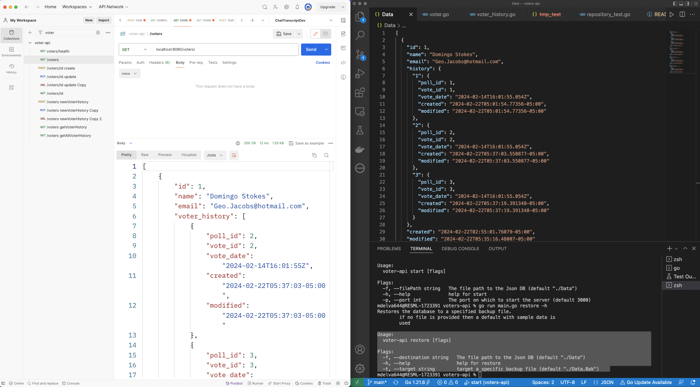
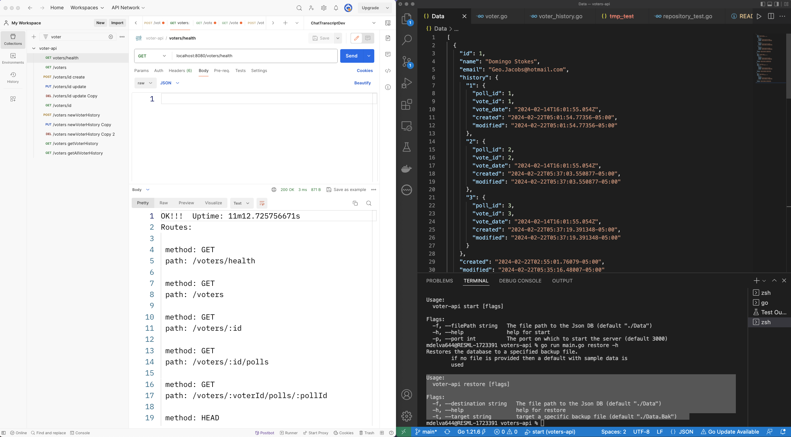
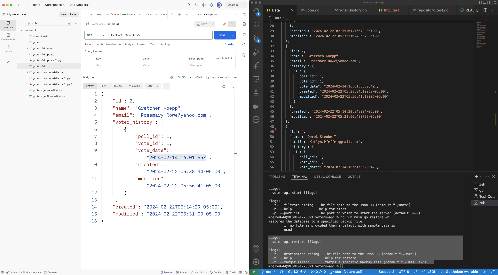
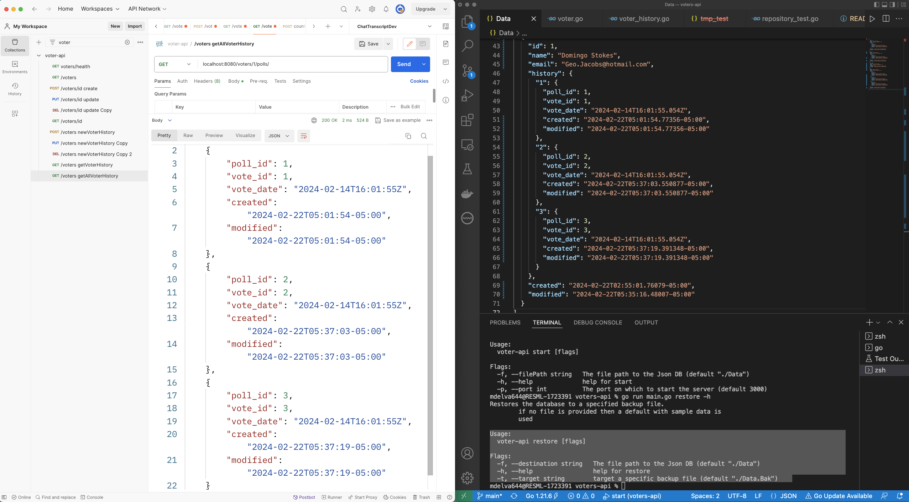
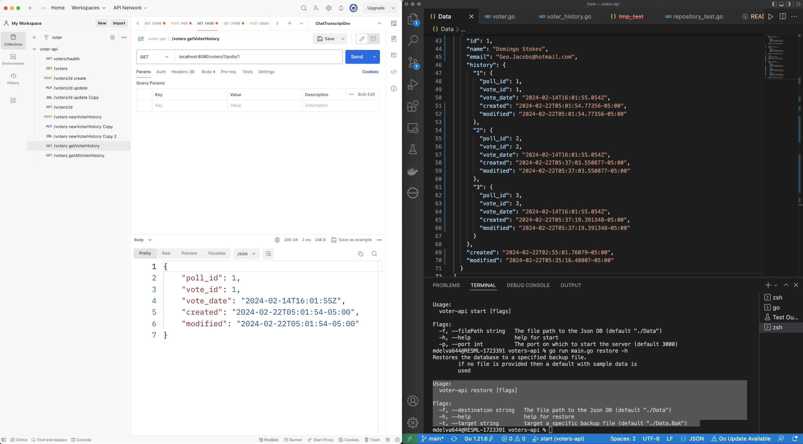
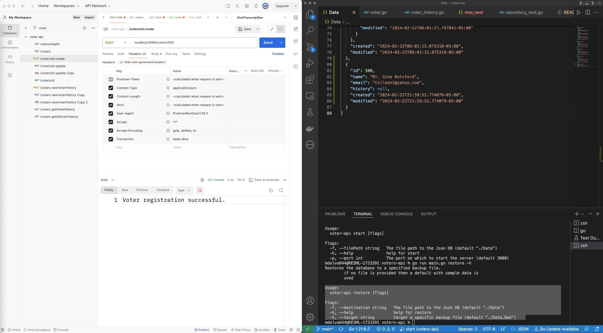
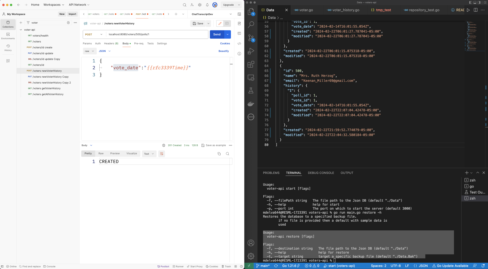
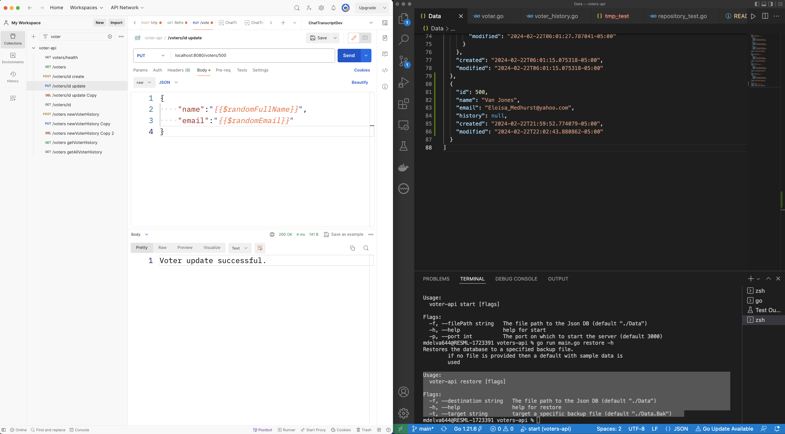
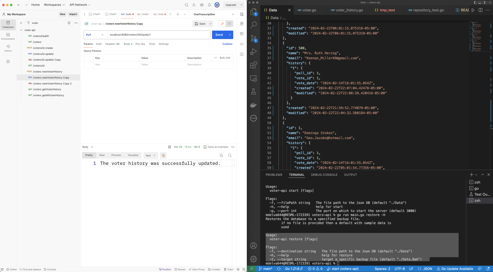

# voter-api

This is a simple API which allows the user to register voters and log voter history.

## Endpoints

**-  GET** /voter/health

returns all available APIs and server uptime. 

**-  GET** /voters

returns all registered voters

**-  POST**  /voters/:id

Registers a voter with the specified id. 

**-  PUT**  /voters/:id

Updates a voter with the specified id. 

**-  DELETE**  /voters/:id

Removes a voter with the specified id.

**-  GET** /voters/:id

Retrieves a voter with the specified id.

**-  POST**  /voters/:id/polls/:pollId

Records a Poll event for the specified voter. 

**-  PUT**  /voters/:id/polls/:pollId

Upates a Poll event for the specified voter. 

**-  DELETE**  /voters/:id/polls/:pollId

Deletes a Poll event for the specified voter. 

**-  GET** /voters/:id/polls/:pollId

Retrieves a specific Poll event with the :pollId from the specified id.

**-  GET** /voters/:id/polls

Retrieves all Poll history for a specified voter.

## CLI Usage
<pre>
Usage:
  voter-api [flags]
  voter-api [command]

Available Commands:
  completion  Generate the autocompletion script for the specified shell
  help        Help about any command
  restore     Restores the database to a backup file
  start       starts the server

Flags:
  -h, --help      help for voter-api
  -v, --version   print the version

</pre>

### Start

<pre>
Usage:
  voter-api start [flags]

Flags:
  -f, --filePath string   The file path to the Json DB (optional)
  -h, --help              help for start
  -p, --port int          The port on which to start the server (default 3000)

</pre>

### restore
<Pre>

Usage:
  voter-api restore [flags]

Flags:
  -f, --destination string   The file path to the Json DB (default "./Data")
  -h, --help                 help for restore
  -t, --target string        target a specific backup file (default "./Data.Bak")

</Pre>

## Supporting Screenshots

 

